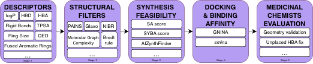

# 🦔 HEDGEHOG
**Hierarchical Evaluation of Drug GEnerators tHrOugh riGorous filtration**




Comprehensive benchmark pipeline for evaluating generative models in molecular design.

### Pipeline Stages:

Each stage takes the output of the previous one, progressively filtering the molecule set:

1) **Mol Prep (Datamol)**: salts/solvents & fragments cleanup, largest-fragment selection, metal disconnection, uncharging, tautomer canonicalization, stereochemistry removal → produces standardized “clean” molecules ([molPrep folder](src/hedgehog/stages/molPrep/))
2) **Molecular Descriptors**: 22 physicochemical descriptors (logP, HBD/HBA, TPSA, QED, etc.) → molecules outside thresholds are removed ([descriptors folder](src/hedgehog/stages/descriptors/))
3) **Structural Filters**: 6 criteria with ~2500 SMARTS patterns (PAINS, Glaxo, NIBR, Bredt, etc.) → flagged molecules are removed ([structural filters folder](src/hedgehog/stages/structFilters/))
4) **Synthesis Evaluation**: SA score, SYBA score, AiZynthFinder retrosynthesis → unsynthesizable molecules are removed ([synthesis folder](src/hedgehog/stages/synthesis/))
5) **Molecular Docking**: SMINA and/or GNINA → binding affinity scoring ([docking folder](src/hedgehog/stages/docking/))
6) **Docking Filters**: post-docking pose quality filtering → poor binders are removed
7) **Final Descriptors**: recalculation on the filtered set

Post-pipeline analysis: MolEval generative metrics

## Setup & Run

```bash
# Clone repository
git clone https://github.com/LigandPro/hedgehog.git
cd hedgehog


# Install AiZynthFinder (for synthesis stage)
./modules/install_aizynthfinder.sh
#
# Alternatively (recommended), install via CLI:
# uv run hedgehog setup aizynthfinder --yes

# Install package with uv
uv sync
```

You are ready to use **🦔 HEDGEHOG** for your purpose!

**Usage**

```bash
# Run full pipeline on a proposed small test data from `data/test/`
uv run hedgehog run

# Alternatively, using the short-name alias:
uv run hedge run

# Run specific stage
uv run hedge run --stage descriptors

# Get help
uv run hedge --help
```

**Terminal UI (TUI)**

For interactive configuration and pipeline management, use the TUI:
```bash
./run-tui.sh
# or
npm run tui
```

See [tui/README.md](tui/README.md) for details.

**Documentation Site**

```bash
cd docs && pnpm install && pnpm dev
```

The docs site is built with [Nextra](https://nextra.site) and available at `http://localhost:3000`.

**HTML Reports**

After each pipeline run, an interactive HTML report is automatically generated as `report.html` in the results folder. The report includes:
- Pipeline summary and molecule retention funnel
- Per-stage statistics and visualizations
- Descriptor distributions
- Filter pass/fail breakdowns
- Synthesis scores and docking results

**Configure your run**
Edit config for each stage in [configs folder](src/hedgehog/configs/) based on metrics you want to calculate.


<!-- ## REINVENT4 fine-tune
To fine-tune REINVENT4 follow these steps:
1. Clone REINVENT4 repository and setup environment:
    ```bash 
    git clone https://github.com/MolecularAI/REINVENT4.git
    ```
2. Configure transfer learning (aka fine-tuning)
   1. Adjust `configs/toml/transfer_learning.toml` following provided `configs/toml/README.md` instructions, 
   2. Set input model file for Mol2Mol generator as provided by authors `priors/reinvent.prior`.
   3. Set the following parameters:
     ```ini
     num_epochs = 1000
     save_every_n_epochs = 10
     batch_size = [adjust appropriately to reduce training time]
     ```
3) Train the model:
     Run the training using the modified configuration file. It takes approximetely 72 hours to train a model on ~750 samples with that setup. 
     
     Once trained, fine-tuned model can be used for downstream evaluation and benchmarking tasks.
--- -->
