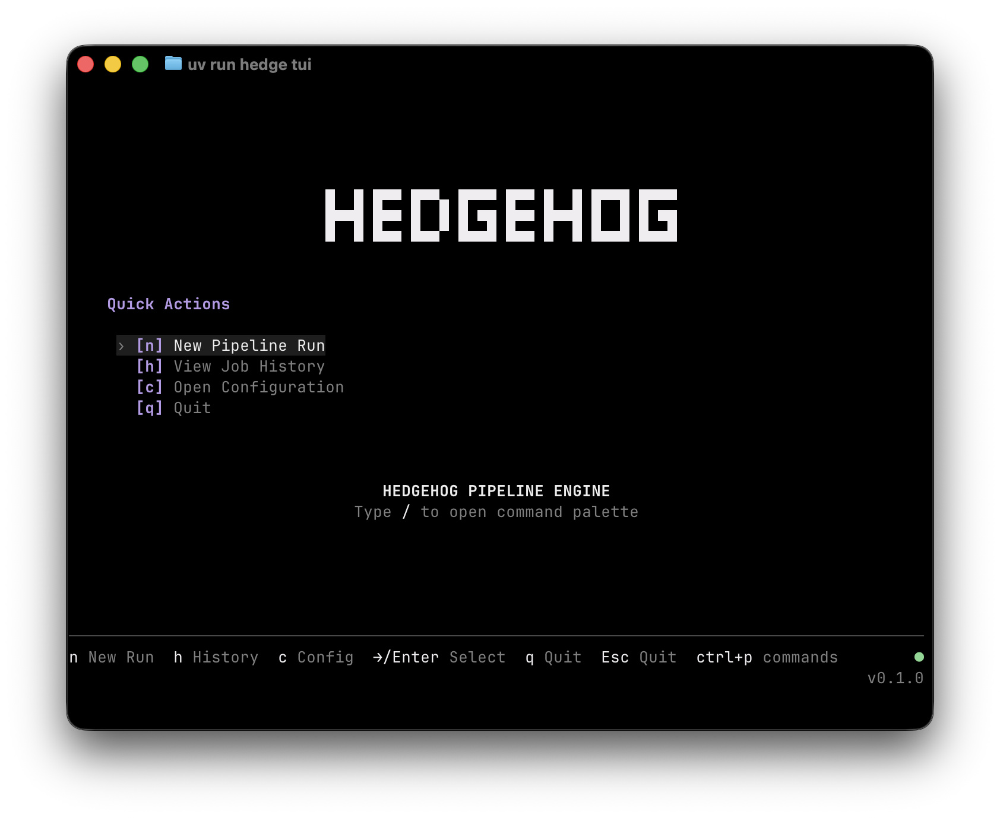

<p align="center">
  
</p>
<p align="center">HEDGEHOG: Hierarchical Evaluation of Drug GEnerators tHrOugh riGorous filtration.</p>
<p align="center">
  <a href="https://pypi.org/project/hedgehog/"></a>
  <a href="https://github.com/LigandPro/hedgehog/actions/workflows/ci.yaml"></a>
  <a href="https://opensource.org/licenses/MIT"></a>
  <a href="https://www.python.org/downloads/"></a>
</p>

<p align="center">
  
</p>
---

HEDGEHOG is a benchmark pipeline for evaluating generated molecules.
It applies a staged filtering workflow (standardization, descriptors, structural filters, synthesis checks, docking, and post-docking validation) and generates an interactive HTML report.

## Quick Start

### Install from PyPI

```bash
pip install hedgehog
hedgehog --help
```

### Install from source

```bash
git clone https://github.com/LigandPro/hedgehog.git
cd hedgehog
uv sync
```

### First run

```bash
uv run hedgehog

# Optional: auto-install missing optional tools without prompts
uv run hedgehog --auto-install
```

## Common Commands


```bash
# Full pipeline
uv run hedgehog

# Run with your own molecules
uv run hedgehog --mols input/my_molecules.csv

# Run a single stage
uv run hedgehog --stage descriptors

# Run docking with a live progress bar
uv run hedgehog --stage docking --progress

# Run docking without progress bar (default)
uv run hedgehog --stage docking

# Regenerate report for an existing run
uv run hedgehog report results/run_10

# Show stages / version
uv run hedgehog info
uv run hedgehog version

# Launch terminal UI
uv run hedgehog tui
```

Progress bar behavior in CLI runs:
- Enabled: add `--progress`
- Disabled: omit `--progress` (default)

## Documentation

For full details, use the documentation instead of this README:

- [Introduction](docs/content/index.mdx)
- [Getting Started](docs/content/getting-started.mdx)
- [CLI Reference](docs/content/cli.mdx)
- [Pipeline Stages](docs/content/pipeline/index.mdx)
- [Configuration](docs/content/configuration/index.mdx)
- [Reporting](docs/content/reporting/index.mdx)
- [Advanced Topics](docs/content/advanced/architecture.mdx)
- [TUI README](tui/README.md)

To run the docs site locally:

```bash
cd docs
pnpm install
pnpm dev
```

## License

MIT
