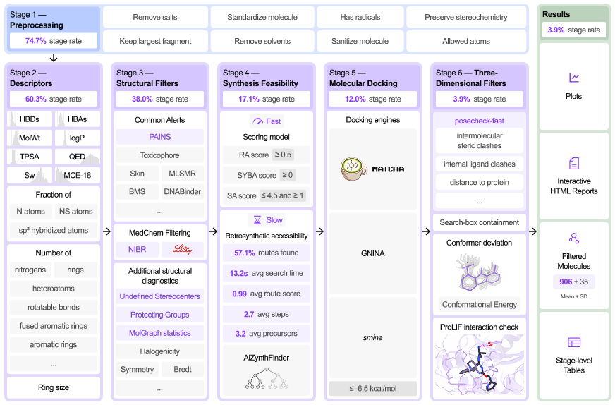

<p align="center">
  <picture>
    <source media="(prefers-color-scheme: dark)" srcset="docs/public/hedgehog-title-light.png" />
    <source media="(prefers-color-scheme: light)" srcset="docs/public/hedgehog-title-dark.png" />
    
  </picture>
</p>
<p align="center">HEDGEHOG: Hierarchical Evaluation of Drug GEnerators tHrOugh riGorous filtration.</p>
<p align="center">
  <a href="https://pypi.org/project/hedgehog/"></a>
  <a href="https://hedgehog.ligandpro.ru"></a>
  <a href="https://github.com/LigandPro/hedgehog/actions/workflows/ci.yaml"></a>
  <a href="https://opensource.org/licenses/MIT"></a>
  <a href="https://www.python.org/downloads/"></a>
</p>

<p align="center">
  
</p>


## Quick Start

HEDGEHOG is a stage-based molecular design evaluation pipeline for:

- molecule preparation
- descriptor calculation
- structural filtering
- retrosynthesis filtering
- docking
- docking pose filtering
- final reports

The full pipeline can require optional external tools and receptor inputs. Start
with the safe smoke run below to verify the Python environment, bundled example
molecules, descriptor calculation, and structural filters before enabling
retrosynthesis or docking.

[Public documentation](https://hedgehog.ligandpro.ru)

### Recommended install: source checkout

```bash
git clone https://github.com/LigandPro/hedgehog.git
cd hedgehog
uv sync
```

This is the recommended way to run HEDGEHOG end to end. The repository checkout contains the editable configs, bundled examples, TUI sources, and the `modules/` workspace used to store optional tool assets such as AiZynthFinder public data.

Requirements:

- Python 3.10+
- `uv`
- optional: Node.js >= 18 and npm for the TUI
- optional: AiZynthFinder for retrosynthesis
- optional: GNINA, SMINA, or Matcha for docking

### PyPI install

```bash
python -m pip install hedgehog
hedgehog --help
```

Use the PyPI package only if you already manage your own config files and input paths. The default quick start, `hedgehog setup ...` workflows, and TUI usage are designed around a source checkout.

### First safe run

```bash
uv run hedgehog --stage descriptors --stage struct_filters --force-new
```

This avoids docking and retrosynthesis. Use it as the first validation that the
local environment, bundled examples, descriptor calculation, and structural
filters are working.

### Full pipeline

```bash
uv run hedgehog setup aizynthfinder
uv run hedgehog --auto-install
```

Full pipeline execution may require AiZynthFinder, GNINA/SMINA/Matcha, valid
receptor structures, reference ligands, and enough CPU/GPU resources.

## Input Format

Recommended molecule input is CSV/TSV with a `smiles` header:

```csv
smiles,model_name
CCO,demo
CCN,demo
c1ccccc1,demo
```

Required:

- `smiles`

Optional:

- `model_name` or `name`
- `mol_idx`

If `mol_idx` is missing, HEDGEHOG assigns a stable ID and uses it to join stage
outputs, docking scores, and report data.

## Common Commands

```bash
# Safe smoke run
uv run hedgehog --stage descriptors --stage struct_filters --force-new

# Full pipeline after optional tools are available
uv run hedgehog --auto-install

# Run with your own molecules
uv run hedgehog --mols input/my_molecules.csv

# Run a single stage
uv run hedgehog --stage descriptors

# Run multiple selected stages
uv run hedgehog --stage descriptors --stage struct_filters

# Run docking with a live progress bar
uv run hedgehog --stage docking --progress

# Run docking without progress bar (default)
uv run hedgehog --stage docking

# Regenerate report for an existing run
uv run hedgehog report results/run_10

# Show stages / version
uv run hedgehog info
uv run hedgehog version

# Launch terminal UI
uv run hedgehog tui
```

Progress bar behavior in CLI runs:
- Enabled: add `--progress`
- Disabled: omit `--progress` (default)

## Results

Results are written under the configured output directory, usually as an
auto-numbered run folder:

```text
results/run_N/
├── stages/
├── output/
└── report.html
```

### Benchmark Results
#### Filtering pass rates by model class
Percentages are computed relative to the initial set for each model class. Unconditional and protein-based models each start from 8,000 molecules, and ligand-based models start from 6,000 molecules.
<table>
  <thead>
    <tr><th rowspan="2">Stage / Pass Rate</th> <th colspan="2">Unconditional</th> <th colspan="2">Ligand-based</th> <th colspan="2">Protein-based</th></tr>
    <tr>                                           <th>#mols</th><th>%</th><th>#mols</th><th>%</th>  <th>#mols</th><th>%</th></tr>
  </thead>
  <tbody>
    <tr><td>Initial</td>                           <td>1000.0 ± 0.0</td><td>100.00 ± 0.00</td>       <td>1000.0 ± 0.0</td><td>100.00 ± 0.00</td>   <td>1000.0 ± 0.0</td><td>100.00 ± 0.00</td></tr>
    <tr><td>Preprocessing / Init</td>              <td>802.2 ± 254.4</td><td>80.22 ± 25.44</td>      <td>682.6 ± 349.6</td><td>68.26 ± 34.96</td>  <td>653.8 ± 292.8</td><td>65.38 ± 29.28</td></tr>
    <tr><td>Descriptors / Init</td>                <td>660.9 ± 311.2</td><td>66.09 ± 31.12</td>      <td>573.4 ± 303.9</td><td>57.34 ± 30.39</td>  <td>481.2 ± 268.2</td><td>48.12 ± 26.82</td></tr>
    <tr><td>Structural Filters / Init</td>         <td>450.0 ± 276.7</td><td>45.00 ± 27.67</td>      <td>342.1 ± 241.5/td><td>34.20 ± 24.15</td>   <td>276.6 ± 203.3</td><td>27.66 ± 20.33</td></tr>
    <tr><td>Synthesis Feasibility / Init</td>      <td>286.5 ± 244.9</td><td>28.65 ± 24.49</td>      <td>58.2 ± 53.0</td><td>5.82 ± 5.30</td>      <td>104.1 ± 157.1</td><td>10.41 ± 15.71</td></tr>
    <tr><td>Docking / Init</td>                    <td>198.9 ± 162.6</td><td>19.89 ± 16.26</td>      <td>42.8 ± 42.0</td><td>4.28 ± 4.20</td>      <td>70.0 ± 95.2</td><td>7.00 ± 9.52</td></tr>
    <tr><td>3D Filters / Init</td>                 <td>55.2 ± 43.1</td><td>5.52 ± 4.31</td>          <td>17.4 ± 22.2</td><td>1.74 ± 2.22</td>      <td>29.1 ± 43.0</td><td>2.91 ± 4.30</td></tr>
  </tbody>
</table>

#### Top generators by final pass count
Best-performing generators within each model class, ranked by the number of molecules that pass the full HEDGEHOG pipeline.
<table>
  <thead>
    <tr><th rowspan="2">Rank</th><th colspan="2">Unconditional</th><th colspan="2">Ligand-based</th><th colspan="2">Protein-based</th></tr>
    <tr><th>Generator</th><th>Final</th> <th>Generator</th><th>Final</th> <th>Generator</th><th>Final</th></tr>
  </thead>
  <tbody>
    <tr><td align="right">1</td> <td>REINVENT4</td><td align="right">102.0 ± 5.0 </td>    <td>REINVENT4 (P)</td> <td align="right"> 61.3 ± 11.9</td>  <td>Dragonfly</td><td align="right">127.0 ± 18.1</td></tr>
    <tr><td align="right">2</td> <td>MoLeR</td><td align="right">92.7 ± 9.7</td>          <td>PGMG</td><td align="right">24.3 ± 2.3</td>              <td>DrugFlow</td><td align="right">58.0 ± 8.5</td></tr>
    <tr><td align="right">3</td> <td>HierGraphVAE</td><td align="right">91.7 ± 9.5</td>   <td>MolFinder (TL)</td><td align="right">12.0 ± 0.0</td>    <td>Pocket2Mol</td><td align="right">31.0 ± 11.5</td></tr>
    <tr><td align="right">4</td> <td>JT-VAE</td><td align="right">74.7 ± 12.0</td>        <td>GCPG</td><td align="right">3.3 ± 1.5</td>               <td>Dragonfly (b)</td><td align="right">9.7 ± 3.1 </td></tr>
    <tr><td align="right">5</td> <td>MolGPT</td><td align="right">73.0 ± 6.6</td>         <td>GENTRL</td><td align="right">3.3 ± 1.5</td>             <td>ProtoBind-Diff</td><td align="right">6.0 ± 2.6 </td></tr>
    <tr><td align="right">6</td> <td>ShEPhERD</td><td align="right">4.0 ± 1.0</td>        <td>REINVENT4 (TL)</td><td align="right">0.0 ± 0.0</td>     <td>DiffSBDD</td><td align="right">0.7 ± 1.2</td></tr> 
    <tr><td align="right">7</td> <td>TGM-DLM</td><td align="right">3.0 ± 0.0</td>         <td>—</td><td align="right">—</td>                          <td>TargetDiff</td><td align="right">0.3 ± 0.6</td></tr>
    <tr><td align="right">8</td> <td>EDM</td><td align="right">0.3 ± 0.6</td>             <td>—</td> <td align="right">—</td>                         <td>ResGen</td><td align="right">0.0 ± 0.0</td></tr>
  </tbody>
</table>

## Documentation



For full details, use the documentation instead of this README:

- [Public documentation](https://hedgehog.ligandpro.ru)
- [Introduction](docs/content/index.mdx)
- [Getting Started](docs/content/getting-started.mdx)
- [CLI Reference](docs/content/cli.mdx)
- [TUI](docs/content/tui.mdx)
- [Pipeline Stages](docs/content/pipeline/index.mdx)
- [Configuration](docs/content/configuration/index.mdx)
- [Reporting](docs/content/reporting/index.mdx)
- [Advanced Topics](docs/content/advanced/architecture.mdx)
- [TUI README](tui/README.md)

To run the docs site locally:

```bash
cd docs
pnpm install
pnpm dev
```

## License

MIT
